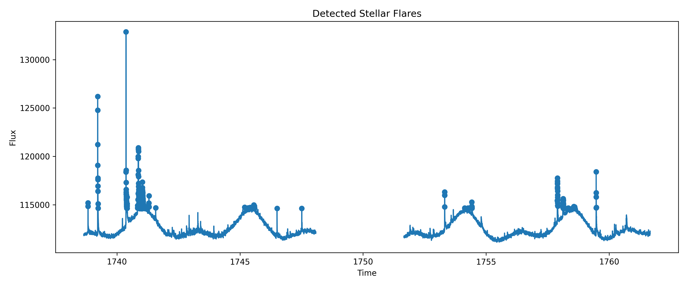

# Stellar Flare Detector

Detect stellar flare events from TESS light curves using Python.

## Features

- Download TESS light curves
- Detect flare candidates
- Highlight flare events
- Visualize stellar activity
- Save output plots

## Dataset

Mission:

**TESS (Transiting Exoplanet Survey Satellite)**

Target:

**EV Lac**

Type:

**Active M-dwarf flare star**

## Output Preview

## Tools Used

- Python
- Lightkurve
- NumPy
- Matplotlib
- SciPy
- Pandas

## Scientific Context

Flare detection is useful for:

- Stellar activity studies
- Active M-dwarf analysis
- Time-series astronomy
- Feature extraction workflows
- Future ML and XAI pipelines

EV Lac is a well-known flare star with strong magnetic activity and frequent flare events observed with TESS.

